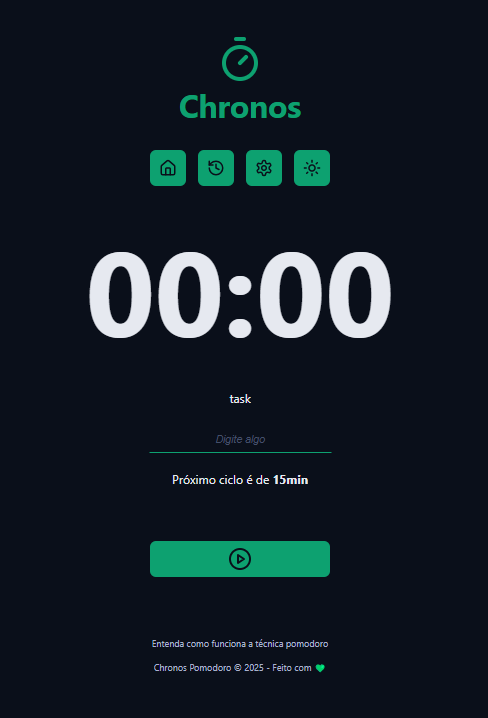
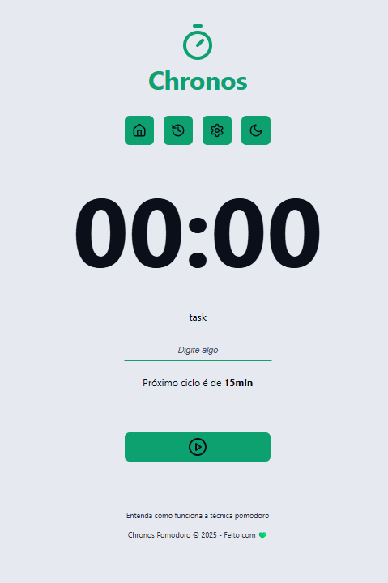
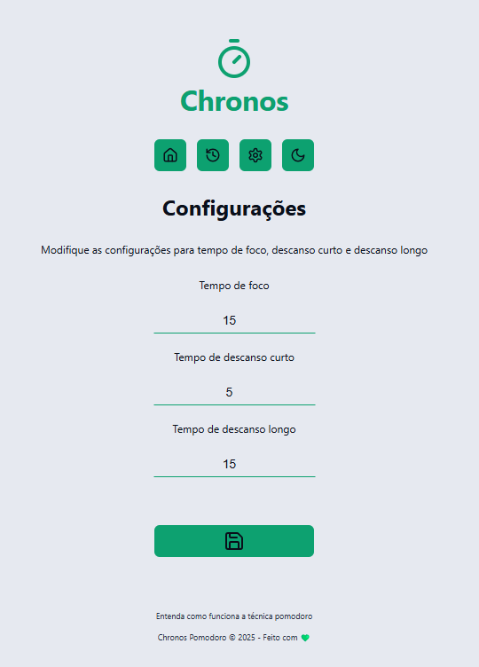

# Chronos Pomodoro

Projeto desenvolvido no curso de react do Prof. Luiz Otávio no nível iniciante do curso.

## Features do projeto

- Tema light/dark
- Tempos ajustáveis para descanso e tempo de trabalho
- Contador em segundo plano que não é interrompido ao navegar/minimizar a página
- É possível instalar no navegador Google Chrome devido ao manifest
- Executa audio ao terminar o ciclo
- Persistência dos dados localmente

## Sobre a técnica de pomodoro

Saiba mais sobre a técnica na página [/about-pomodoro](src/pages/about-pomodoro/index.tsx)

## Scripts

- `pnpm run dev` -> Executar ambiente de desenvolvimento
- `pnpm run build` -> Geração da build de produção
- `pnpm run preview` -> visualização da build

## Tecnologias

- Javascript
- Typescript
- React (ViteJS)

## Bibliotecas utilizadas

- `lucide-react` - Renderiza ícones em SVG
- `toastify` - Para utilizar toasts
- `react-router` - Para navegação
- `date-fns` - Formatação simplificada de datas

## Coisas que aprendi com este projeto

- Usar css modules com o react
- Usar WebWorkers em segundo plano
- Usar reducers nativos do react, embora a biblioteca zustand trate disso com mais facilidade
- Tocar (e carregar) audios no navegador
- Implementação e importância do padrão adapter
- Hackzinho de componente para ScrollToTop quando navegar
